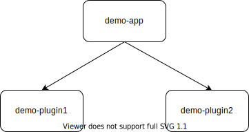
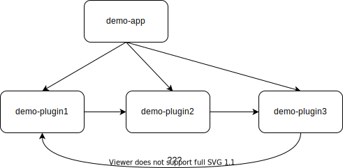
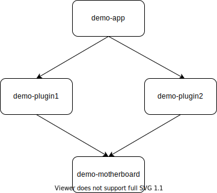

# About

Inversion of Control (IoC) via vite in build time, a simple yet powerful way to modularize code

# What was the problem?

Given this dependency relationship



There are problems:

* demo-app can access everything, it is likely all code will end up in demo-app, nothing left in demo-plugin1, demo-plugin2
* when there is requirement to access data provided by demo-plugin2, demo-plugin1 will need to add dependency of demo-plugin2, otherwise the logic need to be "pulled up" into demo-app

If we allow dependency between plugins, circular dependency tend to emerge



# Inversion of Control

It is easier to control dependency via Inversion of Control (IoC)



This fixs a lot of problems

* demo-app can be nearly empty project, even we can add static check to enforce this to encourage logic modularization
* if same page need to show components from plugin1 and plugin2, we assemble them in motherboard, checkout [example](./packages/demo-motherboard/src/SomePage.tsx)
* if plugin2 need to call plugin1, we declare the spi in [motherboard](./packages/demo-motherboard/ext/plugin1.d.ts), then we can call it in [plugin2](./packages/demo-plugin2/src/ComponentProvidedByPlugin2.tsx)
* as plugin2 does not depend on plugin1 directly, even if plugin1 [export function secretHiddenByPlugin1](./packages/demo-plugin1/src/ComponentProvidedByPlugin1.tsx), plugin2 can not access it, this ensures all spi must be defined in demo-motherboard

# pnpm monorepo + typescript + vite

Inversion of Control is not new. It is a good old trick to enforce logic modularization. What is new:

* pnpm: it brings monorepo, simplifies version management via [`workspace:*`](./packages/demo-app/package.json)
* typescript: use [`declare module`](./packages/demo-motherboard/ext/plugin1.d.ts) to declare the spi, use [`tsconfig.json`](./packages/demo-plugin1/tsconfig.json) to import spi
* vite: use [`vite.config.ts`](/packages/demo-app/vite.config.ts) to link spi to specific implementation

Compared to IoC via runtime code composition:

```ts
export function SomePage(props: {
    Comp1: () => any,
    Comp2: () => any
}) {
    const { Comp1, Comp2 } = props;
    return <div><Comp1/><Comp2/></div>
}
```

The caller of SomePage (which is demo-app in this demo), will need to assemble it properly. This results in code bloat of the top level package demo-app.

Static code composition does not need demo-app to participate in business logic, it only need define a [vite.config.ts](./packages/demo-app/vite.config.ts)

```ts
import { defineConfig } from 'vite'
import vue from '@vitejs/plugin-vue'

export default defineConfig({
  plugins: [vue(), {
    // we can inject different implementation, 
    // as long as @plugin1 interface has been implemented
    name: 'inject @plugin1',
    resolveId(id) {
      if (id === '@plugin1') {
        return 'demo-plugin1';
      }
    }
  }, {
    // we can inject different implementation, 
    // as long as @plugin2 interface has been implemented
    name: 'inject @plugin2',
    resolveId(id) {
      if (id === '@plugin2') {
        return 'demo-plugin2';
      }
    }
  }],
  base: '',
})
```

How to assemble plugin is done in the [demo-motherboard](./packages/demo-motherboard/src/SomePage.tsx) instead

```ts
import { ComponentProvidedByPlugin1 } from '@plugin1';
import { ComponentProvidedByPlugin2 } from '@plugin2';
import * as vue from 'vue';

export const SomePage = vue.defineComponent({
    render() {
        return <div>
            ===
            <ComponentProvidedByPlugin1 msg="hello" />
            ===
            <ComponentProvidedByPlugin2 position="blah" />
        </div>
    }
})
```

The code is easier to read this way. As we can see ComponentProvidedByPlugin1 is imported from `@plugin1` statically.

If code modularization is the goal, we do not need micro-frontend to enforce it, typescript is better for the job.